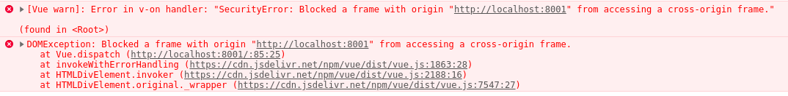

# Micro Front End

P.O.C. para avaliar os desafios da implementação técnica do modelo arquitetural micro-fronted.

Foram criados 4 microfronts, o **combinado** foi que cada microfrontend tenha um counter, composto por display, botão - e botão +, quando o botão é precionado ele aumenta ou dominui o valor que estava no display e dispara evento através do window.dispatchEvent que poderia ser ouvido pelo compositor e ouvido por todos os mifro-fronteds compostos.

## Composição por Iframe

A utilização do iframe a princípio pareceu ser a mais simples de ser utilizada, mas
durante a implementação diversos desafios e limitações foram encontadas.


### Limitações na propagação do evento

A propagação do evento através de ***window.dispatchEvent*** não funcionou, pois os microfrontends encapsulados no iframe tem seu contexto totalmente isolado. Para propagar o evento para o compositor é necessário disparar o evento para  ***window.parent.dispatchEvent***, com essa alteração tivemos duas consequencias a primeira foi a execução de dois disparos um para a ***window.dispatchEvent*** e  ***window.parent.dispatchEvent***.

A segunda consequência foi que os microfrontends foram bloqueados ao tentar disparar  evento para o compositor.

### Desafios: Bloqueio por validação de origem



Para solucionar essa questão foi criado um proxypass com o Nginx para expor todos os microfrontends no mesmo hostname e porta da composição, sendo diferenciada pelo context /angular /vue /react

O microfrontend em Angular está rodando em localhost:4200 e o microfrontend em Vue está rodando em localhost:8001. Foi criado a seguinte configuração com proxy-pass e rewrite do content.

```
server {
    listen 8090;
    server_name localhost;

    root /usr/share/nginx/html;
    index iframe.html;
    ssi off;

    location /angular {
        proxy_set_header Host $host;
        proxy_set_header X-Real-IP $remote_addr;
        proxy_pass http://localhost:4200/;
        sub_filter_once off;
        sub_filter_types text/html;
        sub_filter "http://localhost:4200" "http://localhost:8090/angular";
        sub_filter '<script src="' '<script src="/angular/';
    }

    location /vue {
        proxy_set_header Host $host;
        proxy_set_header X-Real-IP $remote_addr;
        proxy_pass http://172.18.0.1:8001/;
        sub_filter_once off;
        sub_filter_types text/html;
        sub_filter "http://localhost:8001" "http://localhost:8090/vue";
    }

    # All locations should render through index.html
    error_page 404 /index.html;
}
```


## Novas limitações

- Quando um microfrontend disparava o evento ele propagava somente até o compositor, seu parent, os seus mifrofrontends pares, irmãos, não recebem o evento;

- Responsividade é algo muito dificil de se trabalhar;

- Search Engine Optimization é impactado de forma fulminante;

- Sobrecarga de objetos window, causando lentidão na navegação;


*Para propagar o evento entre os microfrontends foi criada uma função chamada repeater:*

``` 
function repeater(ev) {
    var iframes = document.getElementsByTagName('iframe')
    for(var i = 0;  i < iframes.length; i++){
        iframes[i].contentWindow.dispatchEvent(
            new CustomEvent(
                'increment', 
                {
                    detail : ev.detail
                }
            )
        )
    }
}

```

## Para rodar o teste 

Suba os dois microfrontends e execute:
```
docker-compose up
``` 


---


## Composição por Backend